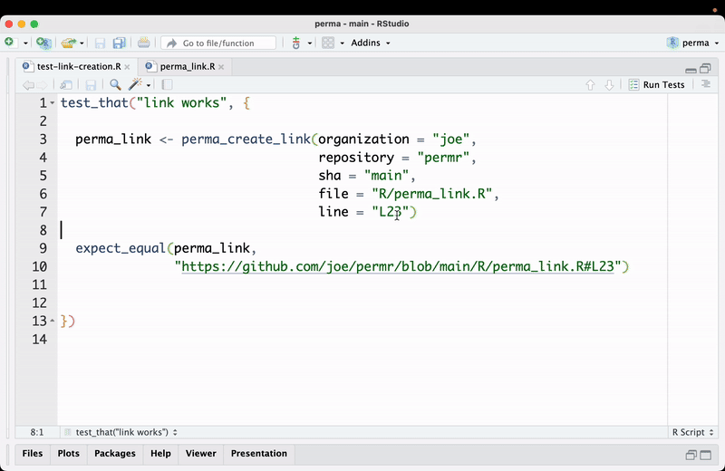
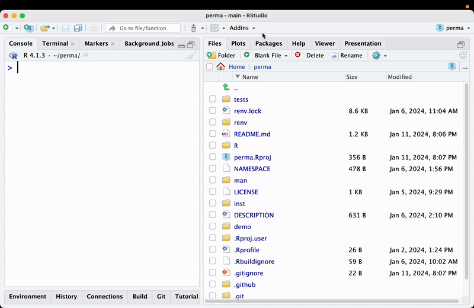
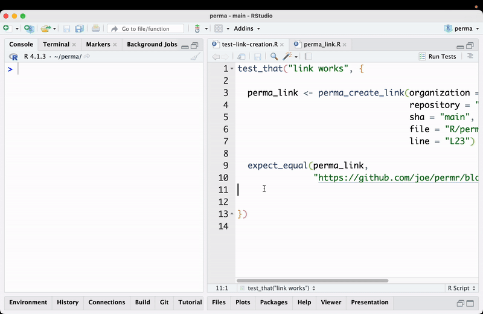

# perma

An Rstudio addin to create shareable github [perma links](https://docs.github.com/en/get-started/writing-on-github/working-with-advanced-formatting/creating-a-permanent-link-to-a-code-snippet).

For instance this perma link:
`https://github.com/joeDespres/perma/blob/9b62543054ab4e1c9e6ea60da69458c3cdcb973e/tests/testthat/test-link-creation.R#L3-L5`. Will take you directly to line 3-5 of a test file. I find it to be a great way to refer a collaborator to specific code snippets in a repo.

Inspired by [gitlinker](https://github.com/ruifm/gitlinker.nvim)

# Getting Started

```
devtools::install_github("joeDespres/perma")
```

# Demos

### Open Perma Link In Browser


### Move to Perma Link


### Send Link to Console



:white_check_mark: Create github perma link at cursor: `perma_link_to_console` <br /> 
:white_check_mark: Open github at cursor or selection: `perma_open_perma_link` <br /> 
:white_check_mark: Move cursor to perma link: `perma_move_to_link` <br />

Recommended key bindings
```
~/.config/rstudio/keybindings/addins.json
{
    "perma::perma_link_to_console": "Ctrl+`",
    "perma::perma_move_to_link": "Ctrl+T",
    "perma::perma_open_perma_link": "Ctrl+G"
}
```

Note this is a work in progress so this is lacking quite a bit of polish.
